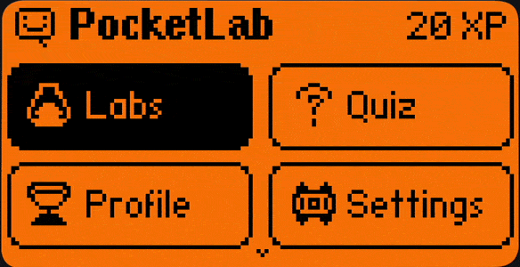
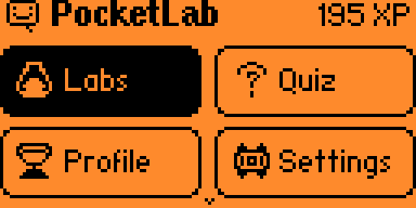
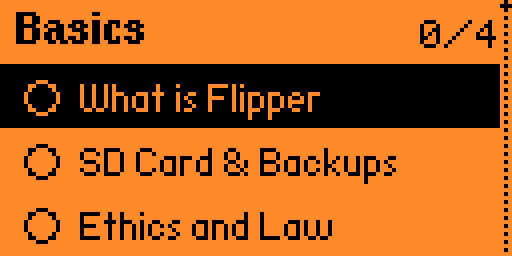
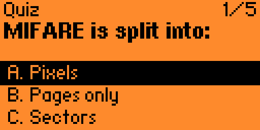
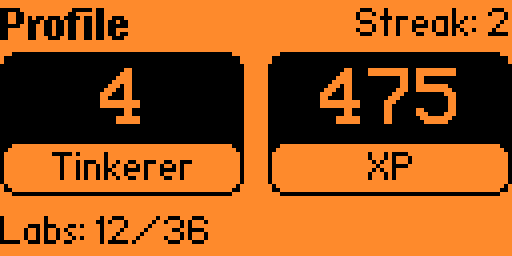
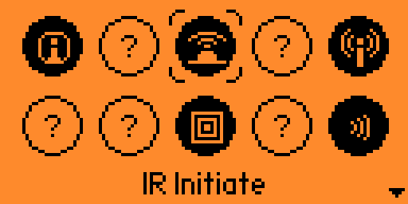

# PocketLab (ESP32 Port)

<div align="center">



<br/>

**Aprende a dominar las funciones de Flipper con laboratorios interactivos y gamificados, ahora en tu ESP32.**  
*Gamified, on-device interactive learning for Flipper Zero & ESP32 Dev Boards.*

[](LICENSE)
[](https://github.com/Sor3nt/Flipper-Zero-ESP32-Port)
[](https://afel.cl/products/modulo-esp32-s3-t-embed-cc1101-lilygo)

</div>

---

## 🙏 Agradecimientos y Créditos / Acknowledgements

Este proyecto es una adaptación y compilación de **PocketLab** para el ecosistema de **Flipper Zero en ESP32**. Agradecemos profundamente a:

* **[PerfectoWeb (@PerfectoWeb)](https://github.com/PerfectoWeb)**: Creador original de [flipper-pocketlab](https://github.com/PerfectoWeb/flipper-pocketlab), por conceptualizar y programar esta increíble aplicación de aprendizaje gamificado (labs, quizzes, insignias, progresión y animaciones).
* **[@Sor3nt](https://github.com/Sor3nt)**: Creador del port maestro [Flipper-Zero-ESP32-Port](https://github.com/Sor3nt/Flipper-Zero-ESP32-Port), que hace posible ejecutar Furi OS, la GUI canvas y el cargador dinámico de FAPs en microcontroladores ESP32 (LilyGO T-Embed, Waveshare, DIY boards).
* **[Flipper Devices](https://flipperzero.one/)**: Creadores del Flipper Zero y de la plataforma de desarrollo original.

---

## 📚 ¿Qué es PocketLab?

**PocketLab** es una plataforma educativa interactiva integrada directamente en tu dispositivo. En lugar de leer documentación estática, aprendes mediante retos prácticos cortos, cuestionarios con opciones aleatorias, y un sistema de logros con XP, rachas diarias y medallas desbloqueables.

### ✨ Características principales:
* 🎓 **36 Laboratorios prácticos** organizados en 11 disciplinas:
  * **Infrarrojos (IR):** Protocolos, captura y transmisión.
  * **Sub-GHz:** Modulaciones, CC1101, analizador de frecuencias y RAW.
  * **RFID & NFC:** Lectura de tarjetas, clonación T5577, recuperación de llaves MIFARE (MFKey32).
  * **iButton, BadUSB, GPIO y Bluetooth.**
* 🎲 **Cuestionarios aleatorizados:** Las opciones incorrectas y el orden cambian en cada intento para asegurar un aprendizaje real.
* 🧠 **Modo Examen:** Evalúa tus conocimientos con preguntas aleatorias basadas en los laboratorios que ya has completado.
* 🏆 **Sistema de progresión:** Acumula XP, sube de nivel (Novice, Apprentice, Explorer... Master) y gana medallas exclusivas con iconos dedicados.
* 🔊 **Efectos completos:** Soporte para sonido acústico, efectos de luz RGB-LED y retroalimentación háptica (vibración).
* 🌍 **Idiomas:** Totalmente disponible en **Inglés** y **Ruso** (con fuentes Cirílicas u8g2 personalizadas incluidas).
* 💾 **Persistencia:** Todo el progreso se guarda de forma segura en la tarjeta microSD (`/ext/apps_data/pocketlab/state.bin`).

---

## 📸 Capturas de pantalla

<div align="center">

| Menú Principal | Lista de Labs | Cuestionario |
|:---:|:---:|:---:|
|  |  |  |
| **Perfil & XP** | **Insignias** | **Subida de Nivel** |
|  |  |  |

</div>

---

## 🎮 Compatibilidad y Hardware

Esta compilación en formato `.fap` (ELF reubicable para Xtensa LX7) está optimizada para:

* **LilyGO T-Embed ESP32-S3 CC1101**
* **Módulos DIY ESP32-S3** con pantalla LCD ST7789 / ILI9341 ejecutando el Flipper ESP32 Port.
* **Cualquier módulo ESP32-S3** con soporte para el port de Flipper Zero.

### Controles (LilyGO T-Embed):
* **Rotary Encoder (Girar):** Navegar por las opciones del menú, preguntas del quiz y galerías de insignias.
* **Pulsar Botón Central del Encoder (OK):** Confirmar respuesta, seleccionar lab o avanzar.
* **Botón Lateral (Back):** Volver atrás o salir al menú de Flipper.

---

## 🚀 Instalación en la microSD

1. Descarga el archivo **`pocketlab.fap`** desde la carpeta [`dist/`](dist/pocketlab.fap) de este repositorio.
2. Inserta la tarjeta microSD en tu computadora (o conecta el dispositivo vía *USB Storage*).
3. Copia `pocketlab.fap` en la siguiente ruta:
   ```text
   /ext/apps/Tools/pocketlab.fap
   ```
4. Expulsa la tarjeta de forma segura e insértala en tu placa ESP32.
5. Inicia el sistema y navega a:  
   **Archive ➔ Apps ➔ Tools ➔ PocketLab**

> ⚠️ **Nota de compatibilidad de Firmware:** PocketLab utiliza melodías y fuentes avanzadas de Furi. Requiere una versión del firmware Flipper ESP32 que exporte estos símbolos en `firmware_api.c`.

---

## 🛠️ Compilación desde el código fuente

Si quieres compilar o modificar PocketLab por tu cuenta:

```bash
# Desde el directorio del firmware Flipper-Zero-ESP32-Port:
python build_fap.py /ruta/a/flipper-pocketlab --output-dir /ruta/a/flipper-pocketlab/dist
```

---

## 📄 Licencia

Este proyecto mantiene la licencia original **MIT License**. Consulta el archivo [LICENSE](LICENSE) para más detalles.
